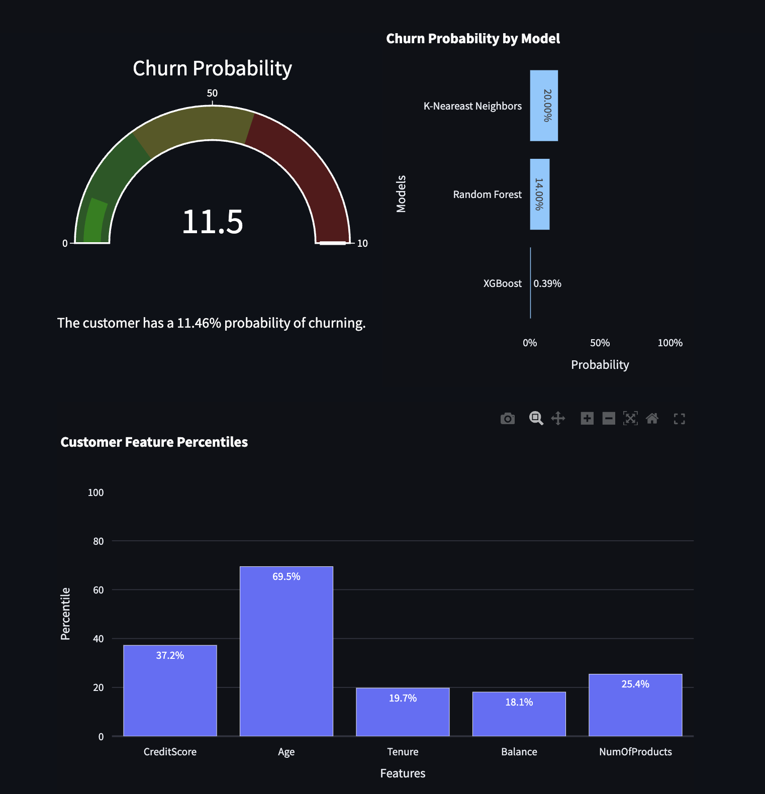

# Customer Churn Predictor

Web app that utilizes XGBoost machine learning model to provide insights on about which customers are likely to churn in a dataset of 10,000 bank customers. Explanations of the predictions and sample email to reduce possibility of churning are generated via Mixtral 7B LLM.

## Table of Contents
- [Customer Churn Predictor](#customer-churn-predictor)
  - [Table of Contents](#table-of-contents)
  - [How it Works](#how-it-works)
  - [Installation](#installation)
  - [Usage](#usage)
  - [Contributing](#contributing)
  - [License](#license)

## How it Works

The entire dataset is in `churn.csv`. That data is extracted into a dataframe and used to train various models like XGBoost (`xgb_model.pkl`), Decision Tree (`dt_model.pkl`), and K-Nearest Neighbors (`knn_model.pkl`). Some models like `xgboost-featureEngineered.pkl` also use a feature-engineered dataset to extract more information from `churn.csv`.
A comprehensive set of trained models is in the `models` folder. Next, this data is used to generate customer insights for the figures in the web app, and models predict the possibility of the selected customer leaving the bank.



These insights are displayed in `plotly` bar charts and gauge charts on the page, calculated with functions from `numpy`, `scipy`, and `scikit-learn` libraries. 

The web app also contains an explanation and email generated by the Mixtral 7B LLM from Groq. The input to this LLM is the various calculations and results that created the customer insights, along with raw data about the customer. The LLM is prompted using CO-STAR prompt engineering techniques to generate an qualitative explanation of the data that explains the results, and an email to lower the risk of the customer leaving the bank.


## Installation

1. Clone this repository
   ```bash
    git clone https://github.com/parky-sood/Customer_Churn_Predictor.git
   ```
2. Install dependencies
   
   You will need to install the following dependencies to successfully render the web app and interact with machine learning models:

    | Package                   | Version       |
    |---------------------------|---------------|
    | altair                    | 5.4.1         |
    | annotated-types           | 0.7.0         |
    | anyio                     | 4.6.2.post1   |
    | attrs                     | 24.2.0        |
    | blinker                   | 1.8.2         |
    | cachetools                | 5.5.0         |
    | certifi                   | 2024.8.30     |
    | charset-normalizer        | 3.4.0         |
    | click                     | 8.1.7         |
    | distro                    | 1.9.0         |
    | gitdb                     | 4.0.11        |
    | GitPython                 | 3.1.43        |
    | h11                       | 0.14.0        |
    | httpcore                  | 1.0.6         |
    | httpx                     | 0.27.2        |
    | idna                      | 3.10          |
    | itsdangerous              | 2.2.0         |
    | Jinja2                    | 3.1.4         |
    | jiter                     | 0.6.1         |
    | joblib                    | 1.4.2         |
    | jsonschema                | 4.23.0        |
    | jsonschema-specifications | 2024.10.1     |
    | markdown-it-py            | 3.0.0         |
    | MarkupSafe                | 3.0.2         |
    | mdurl                     | 0.1.2         |
    | narwhals                  | 1.9.4         |
    | numpy                     | 2.1.2         |
    | openai                    | 1.52.0        |
    | packaging                 | 24.1          |
    | pandas                    | 2.2.3         |
    | pillow                    | 10.4.0        |
    | pip                       | 24.2          |
    | plotly                    | 5.24.1        |
    | protobuf                  | 5.28.2        |
    | pyarrow                   | 17.0.0        |
    | pydantic                  | 2.9.2         |
    | pydantic_core             | 2.23.4        |
    | pydeck                    | 0.9.1         |
    | Pygments                  | 2.18.0        |
    | python-dateutil           | 2.9.0.post0   |
    | python-dotenv             | 1.0.1         |
    | pytz                      | 2024.2        |
    | referencing               | 0.35.1        |
    | requests                  | 2.32.3        |
    | rich                      | 13.9.2        |
    | rpds-py                   | 0.20.0        |
    | scikit-learn              | 1.5.2         |
    | scipy                     | 1.14.1        |
    | six                       | 1.16.0        |
    | smmap                     | 5.0.1         |
    | sniffio                   | 1.3.1         |
    | streamlit                 | 1.39.0        |
    | tenacity                  | 9.0.0         |
    | threadpoolctl             | 3.5.0         |
    | toml                      | 0.10.2        |
    | tornado                   | 6.4.1         |
    | tqdm                      | 4.66.5        |
    | typing_extensions         | 4.12.2        |
    | tzdata                    | 2024.2        |
    | urllib3                   | 2.2.3         |
    | watchdog                  | 5.0.3         |
    | Werkzeug                  | 3.0.4         |
    | xgboost                   | 2.1.1         |


    **Optional:** Set up a virtual environment in cloned project directory before installing dependencies so your Python installation is not cluttered with packages.
    
    To set up Python virtual environment on MacOS/Linux, run:
    ```bash
    python3 -m venv venv
    ```

    To set up Python virtual environment on Windows, run:
    ```cmd
    python -m venv venv
    ```

    Start your virtual environment from the project folder:
    ```bash
    source venv/bin/activate
    ```

    To install dependencies in cloned project directory, run:
   ```bash
   pip install xgboost watchdog streamlit scikit-learn python-dotenv plotly openai 
   ```

3. You will also need a Groq API key to access the Mixtral 7B LLM. To retrieve your key, follow Groq's instructions [here](https://console.groq.com/keys). Paste your API key into a `.env` file with the variable name `GROQ_API_KEY`.

## Usage

1. To view the web app, run:
   
   ```bash
   streamlit run main.py
   ```

   If a browser window with the web app does not open automatically, click the link in the command line labeled `Local URL`.
   
## Contributing

1. Fork the repository.
2. Create a new branch: `git checkout -b feature-name`.
3. Make your changes.
4. Push your branch: `git push origin feature-name`.
5. Create a pull request.

## License

This project is licensed under the [GPL v3 License](LICENSE).
